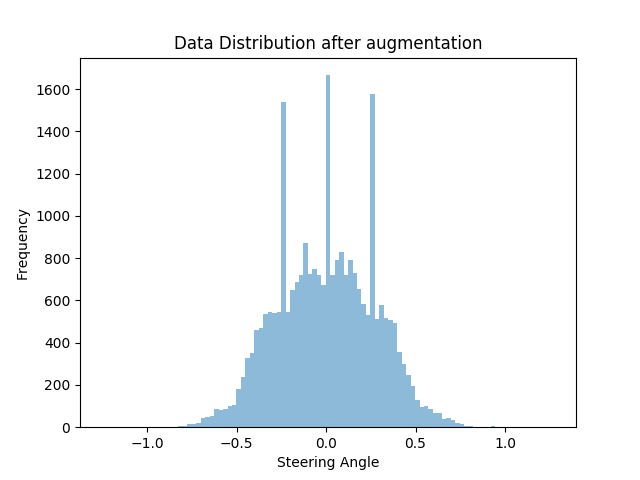

# **Behavioral Cloning** 

## Writeup Template

### You can use this file as a template for your writeup if you want to submit it as a markdown file, but feel free to use some other method and submit a pdf if you prefer.

---

**Behavioral Cloning Project**

The goals / steps of this project are the following:
* Use the simulator to collect data of good driving behavior
* Build, a convolution neural network in Keras that predicts steering angles from images
* Train and validate the model with a training and validation set
* Test that the model successfully drives around track one without leaving the road
* Summarize the results with a written report


## Rubric Points
### Here I will consider the [rubric points](https://review.udacity.com/#!/rubrics/432/view) individually and describe how I addressed each point in my implementation.  

---


### Files Submitted & Code Quality

#### 1. Submission includes all required files and can be used to run the simulator in autonomous mode

My project includes the following files:
| File                         | Description                                                                        |
| ---------------------------- | ---------------------------------------------------------------------------------- |
| `model.py`                   | Contains the model architecture, image preprocesing techniques and runs the training pipeline.                      |
| `model.json`                 | JSON file containing model architecture.             |
| `model.h5`                   | containing a trained convolution neural network                               |
| `drive.py`                   |for driving the car in autonomous mode. |
| `log.txt`                    | Contains the log file which keeps the record of all the models I tried and the validation accuracries achieved. |
| `model_loss.png`, `prediction.png`, `Data_Distribution.png`| Generated images|
| `test.py` | Test file to test the predictions |
| `writeup_report.md`          |          summarizing the results |

#### 2. Submission includes functional code
Using the Udacity provided simulator and my drive.py file, the car can be driven autonomously around the track by executing 
```sh
python drive.py model.json
```

#### 3. Submission code is usable and readable

The model.py file contains the code for training and saving the convolution neural network. The file shows the pipeline I used for training and validating the model, and it contains comments to explain how the code works.

### Model Architecture and Training Strategy

#### 1. An appropriate model architecture has been employed

While researching, I found the NVIDIA's research paper on Behavorial Cloning and I decided to implement it.


My final model consisted of the following layers:

| Layer         		| Description	        											|
|:---------------------:|:-----------------------------------------------------------------:|
| Input         		| 66x200x3 RGB image   												|
|  Convolution 5x5     	| 2x2 stride, valid padding, outputs 31x98x24, 'ReLU' activation	|
|  Convolution 5x5     	| 2x2 stride, valid padding, outputs 14x47x36, 'ReLU' activation	|
|  Convolution 5x5     	| 2x2 stride, valid padding, outputs 5x22x48, 'ReLU' activation		|
|  Convolution 5x5     	| 2x2 stride, valid padding, outputs 3x20x64, 'ReLU' activation		|
|  Convolution 5x5     	| 2x2 stride, valid padding, outputs 1x18x64, 'ReLU' activation		|
|  Flatten     			| Inputs 1x18x64 , outputs 1164 									|
|  Dense				| Inputs 1152 , outputs 1164 , 'ReLU' activation					|
|  Droupout				| 0.5 																|
|  Dense				| Inputs 1164 , outputs 100, 'ReLU' activation						|
|  Dense				| Inputs 100 , outputs 50, 'ReLU' activation						|
|  Droupout 			| 0.5 																|
|  Dense				| Inputs 50 , outputs 10, 'ReLU' activation							|
|  Dense				| Inputs 10 , outputs 1, 'ReLU' activation							|

```
		model = Sequential()
        #model.add(Lambda(lambda x: x / 64 - 0.5, input_shape=(66, 200, 3)))
        model.add(Conv2D(24, 5, strides = (2,2), input_shape=(66, 200, 3), activation='relu'))
        model.add(Conv2D(36, 5, strides = (2,2), input_shape=(31, 98, 24), activation='relu'))
        model.add(Conv2D(48, 5, strides = (2,2), input_shape=(14, 47, 36), activation='relu'))
        model.add(Conv2D(64, 3, input_shape=(5, 22, 48), activation='relu'))
        model.add(Conv2D(64, 3, input_shape=(3, 20, 64), activation='relu'))
        model.add(Flatten())
        model.add(Dense(1164, activation='relu'))
        model.add(Dropout(0.5)) #Added dropout layer to avoid overfitting
        model.add(Dense(100, activation='relu'))
        model.add(Dense(50, activation='relu'))
        model.add(Dropout(0.5)) #Added dropout layer to avoid overfitting
        model.add(Dense(10, activation='relu'))
        model.add(Dense(1))
        model.build()
        model.compile(optimizer=Adam(lr=2e-04), loss= "mse")
```


#### 2. Attempts to reduce overfitting in the model

The model contains dropout layers in order to reduce overfitting (model.py lines 126, 129). 
The model was trained and validated on different data sets to ensure that the model was not overfitting (code line 144). The model was tested by running it through the simulator and ensuring that the vehicle stayed on the track.
Also the model used Adam Optimizer to optimize with the learning rate of `2e-04` and mean squared error was taken into account.

#### 3. Model parameter tuning

The model used an adam optimizer, so the learning rate was not tuned manually (model.py line 133).

#### 4. Appropriate training data

I did not created my custom dataset. I used the one provided by the Udacity. After analysing the data, I found out that the dataset was extremely biased. I contained about 4200 values for straight steering values. While all the left and right steering values were approx 2000 each.

So, to overcome this problem, I augmented the data myself. For all the values that were not straight, i.e. non 0 steering values, I added random number of augmented data and images to the dataset. The augmented image was croped from top and bottom randomly and resized to again 66X200X3 shape. As for the augmented data, the actual value was added with the random number generated from the normal curve with mean as the shift and standard devaition as 0.0003 and the camera steering coefficient. Also, I multipled the augmented value with 10 so that the data will become a bit diverse. Because, TensorFlow at the backend rounded off the values for computation, making many values extremely same.

This data was then flipped randomly along half the indices to make the data distribution even along the distribution.

And at the end, the data was shuffled and returned.

### Model Architecture and Training Strategy

#### 1. Solution Design Approach

The overall strategy for deriving a model architecture was to implement Behavorial Cloning which is effective enough. 

My first step was to use a convolution neural network model similar to the one provided in  by NVIDIA. I tried to make a lot of changes to the model itself and the tried changing various hyperparamters, only to be realized later that the data itself was extremely biased and needs to be well augmented before using.



In order to gauge how well the model was working, I split my image and steering angle data into a training and validation set. I found that my model had a bit low mean squared error on the training set but on the validation set, the error was almost constant but pretty high too. This implied that the model was performing well on training. But then I tried the model performing in the simulator.

The final step was to run the simulator to see how well the car was driving around track one. To my suprise, even after high validation loss, the car seemed to run pretty good on the track.

At the end of the process, the vehicle is able to drive autonomously around the track without leaving the road.


#### 2. Final Model Architecture

The final model architecture consisted of a convolution neural network with the following layers and layer sizes.


| Layer         		| Description	        											|
|:---------------------:|:-----------------------------------------------------------------:|
| Input         		| 66x200x3 RGB image   												|
|  Convolution 5x5     	| 2x2 stride, valid padding, outputs 31x98x24, 'ReLU' activation	|
|  Convolution 5x5     	| 2x2 stride, valid padding, outputs 14x47x36, 'ReLU' activation	|
|  Convolution 5x5     	| 2x2 stride, valid padding, outputs 5x22x48, 'ReLU' activation		|
|  Convolution 5x5     	| 2x2 stride, valid padding, outputs 3x20x64, 'ReLU' activation		|
|  Convolution 5x5     	| 2x2 stride, valid padding, outputs 1x18x64, 'ReLU' activation		|
|  Flatten     			| Inputs 1x18x64 , outputs 1164 									|
|  Dense				| Inputs 1152 , outputs 1164 , 'ReLU' activation					|
|  Droupout				| 0.5 																|
|  Dense				| Inputs 1164 , outputs 100, 'ReLU' activation						|
|  Dense				| Inputs 100 , outputs 50, 'ReLU' activation						|
|  Droupout 			| 0.5 																|
|  Dense				| Inputs 50 , outputs 10, 'ReLU' activation							|
|  Dense				| Inputs 10 , outputs 1, 'ReLU' activation							|

```
		model = Sequential()
        #model.add(Lambda(lambda x: x / 64 - 0.5, input_shape=(66, 200, 3)))
        model.add(Conv2D(24, 5, strides = (2,2), input_shape=(66, 200, 3), activation='relu'))
        model.add(Conv2D(36, 5, strides = (2,2), input_shape=(31, 98, 24), activation='relu'))
        model.add(Conv2D(48, 5, strides = (2,2), input_shape=(14, 47, 36), activation='relu'))
        model.add(Conv2D(64, 3, input_shape=(5, 22, 48), activation='relu'))
        model.add(Conv2D(64, 3, input_shape=(3, 20, 64), activation='relu'))
        model.add(Flatten())
        model.add(Dense(1164, activation='relu'))
        model.add(Dropout(0.5)) #Added dropout layer to avoid overfitting
        model.add(Dense(100, activation='relu'))
        model.add(Dense(50, activation='relu'))
        model.add(Dropout(0.5)) #Added dropout layer to avoid overfitting
        model.add(Dense(10, activation='relu'))
        model.add(Dense(1))
        model.build()
        model.compile(optimizer=Adam(lr=2e-04), loss= "mse")
```


#### 3. Creation of the Training Set & Training Process

I used the given data by Udacity so, I didn't created a training set. I then preprocessed this data by cropping the data from top and bottom and then resizing the image back to 66X200x3 image.


I finally randomly shuffled the data set and put 30% of the data into a validation set. 

I used this training data for training the model. The validation set helped determine if the model was over or under fitting. The ideal number of epochs was not determined by me and I thought 64 epoches would be enough to train the data. I used an adam optimizer so that manually training the learning rate wasn't necessary.
